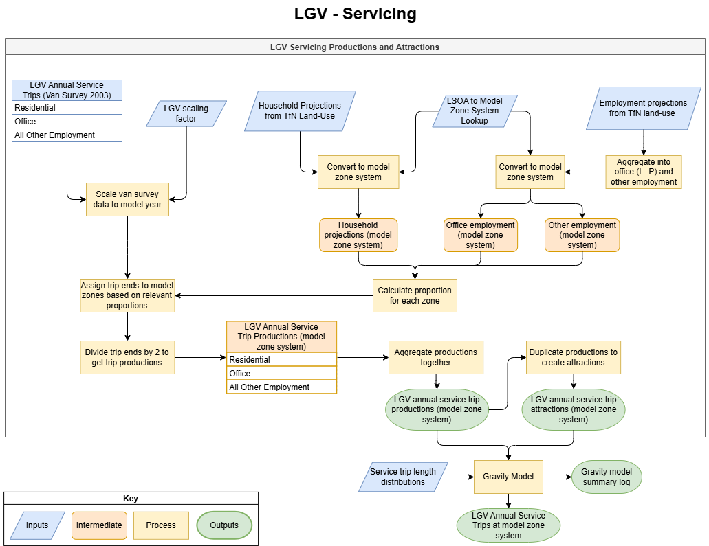
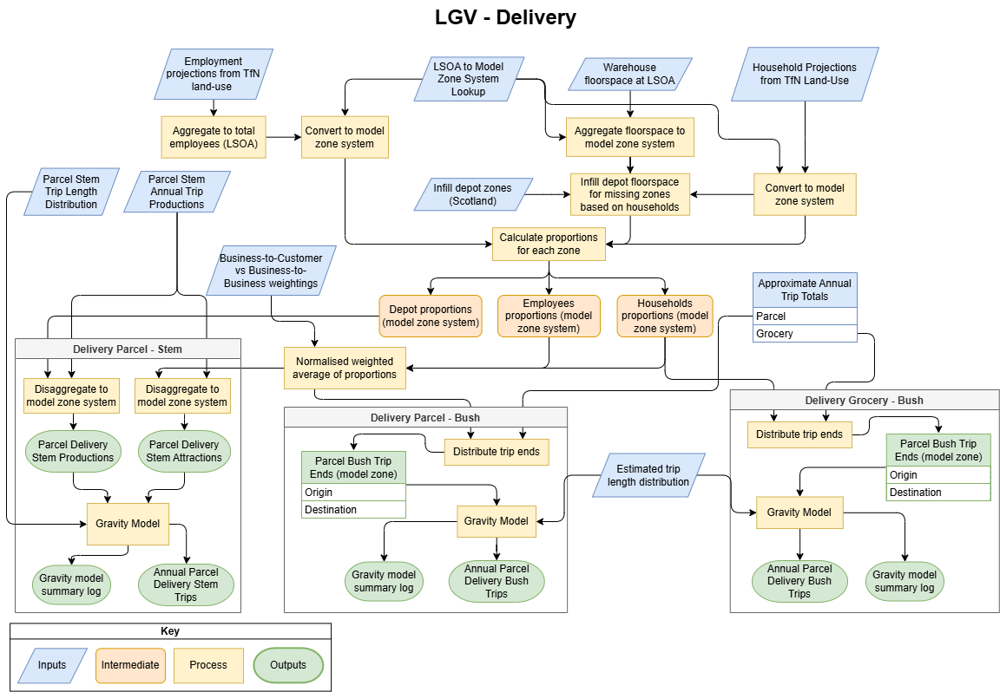
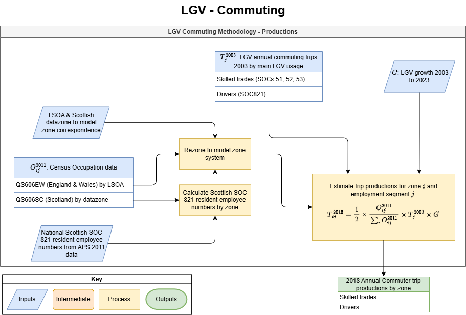
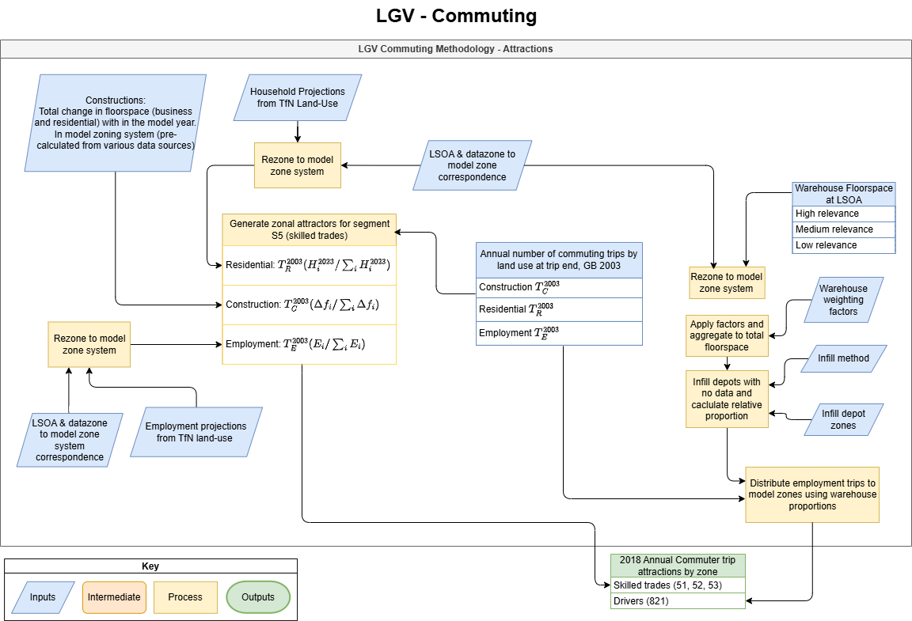

Methodology
===========

The van model is split into six model segments for different types of
van trips, these are the following:

-  Service
-  Delivery Grocery
-  Delivery Parcel Bush
-  Delivery Parcel Stem
-  Commute Drivers
-  Commute Skilled Trades

The van model methodology is split into three sections, only the first
of which varies between model segments, these are as follows:

-  Trip end generation;
-  Gravity model / annual trip matrix creation; and
-  Conversion to time period matrices.

The following sections will discuss each of the three parts of the
methodology in turn, with flowcharts detailing the main components of
each.

Trip End Generation
-------------------

The trip end generation varies for each of the model segments in order
to account for the types of trips that are being modelled. The trip end
generation is done as productions and attractions for each of the
segments except the delivery bush trips where they instead have origin
and destination trip ends.

The trip end generation uses various inputs from the DfT van survey and
census data tables, these are all outlined in the :ref:`van model inputs`
section. This section will discuss the methodologies for the three main
segments (which each contain sub-segments that make up the six total
van model segments).

Service Trip Ends
~~~~~~~~~~~~~~~~~

The trip ends for the service segment are calculated by using employment
and household projections data to distribute the total annual service
trips (from the DfT van survey) to the model zone system. The trip ends
are distributed separately for the sub-segments of Residential, Office
and All Other Employment before being combined together into a single
set of service productions and attractions. The flowchart below outlines
the service trip ends methodology.

      flowchart

   LGV service productions and attractions trip ends methodology

Delivery Trip Ends
~~~~~~~~~~~~~~~~~~

The trip ends for the delivery segment are split into three different
sub-segments, detailed below:

-  Parcel stem: These are delivery trips which originate at the depots
   and end at the first drop-off location. These trips would likely be
   the longest single trip in a delivery round and there would be a
   corresponding return trip back to the depot to pickup more packages.
-  Parcel bush: These are the delivery trips which go between various
   drop-off locations and would tend to be lots of shorter trips.
-  Grocery (bush): These would encompass the trips from the supermarket
   to the customers but would likely all relatively short as the
   supermarkets are closer to the customers than delivery depots are.
   There will be less total grocery trips in a single round but more
   rounds per day as each delivery will be larger than parcel
   deliveries.

The parcel stem trips are calculated as productions and attractions,
whereas both the bush types are origin / destination trip ends. The
flowchart below outlines the methodology for calculating the trip ends
for all three types of delivery trip.

.. todo::
   Update flowchart to show trips are factored using delivery growth factor

   LGV commuting productions trip ends methodology - flowchart

Commuting Trip Ends
~~~~~~~~~~~~~~~~~~~

The trip ends for the commuting segment are split into two sub-segments,
detailed below:

-  Skilled trades: These are the commuting trips which represent skilled
   workers who commute by LGV due to need to carry tools and equipment.
   These workers may be commuting to a construction site or to a
   residential / employment building to provide some service.
-  Drivers: These are the LGV commuting trips which represent resident
   drivers.

Both commuting segments are calculated as productions and attractions,
these methodologies have been split into two flowcharts below, one for
each type of trip end.

.. todo::
   Update flowchart to show trips are factored using growth factor

   LGV commuting productions trip ends methodology

   LGV commuting attractions trip ends methodology

Gravity Model
-------------

The distribution of the trip ends to create annual trip matrices is done
using a bespoke gravity model from [caf.distribute](https://cafdistribute.readthedocs.io/en/stable/).

The gravity model is built of two sections, the first contains the cost functions
(tanner and log normal) to calculate the initial matrix seed values and then performs
either 1D factoring, or 2D furnessing, to constrain the matrix to the trip ends. 

The second section of the gravity model is the outer self-calibration
loop, this finds the optimal cost function parameters to fit the
resulting matrix to the observed trip distribution. The self-calibration
process is detailed in the below flowchart and can be turned on or off
within the main parameters config, see :ref:`van model inputs`.

Time Period Conversion
----------------------

The final process of the LGV model is the conversion from annual to time
period specific trip matrices. The conversion is done by factoring the
annual matrices (for each model segment) by the period factor provided
for each of the given time periods. The time period factors should be
provided separately to respect the different time profiles for each of
the model segments, the factors are provided in the :ref:`van parameters spreadsheet`.
